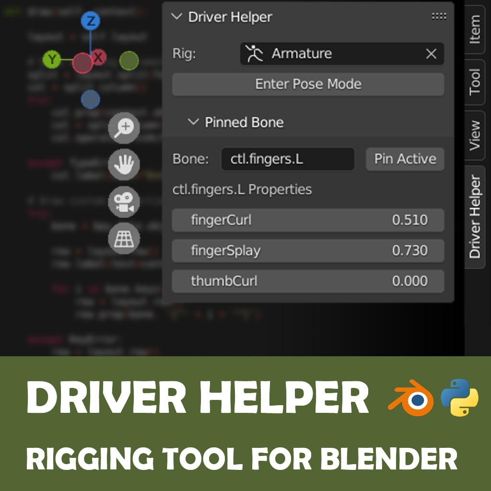

# bpy-toolkit

Small python tools for Blender. 

## Directory

|  |  |
|:--:|:--:|
| [Driver Helper](https://github.com/argallegos/bpy-toolkit/tree/main/driver-helper) |  |

Licensed under the MIT license. 
