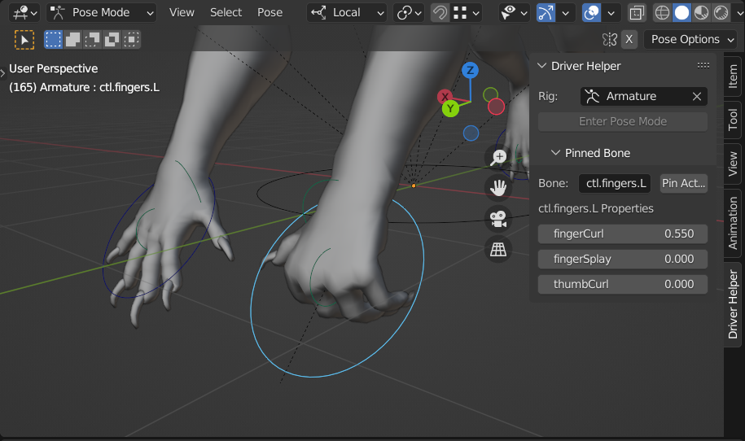
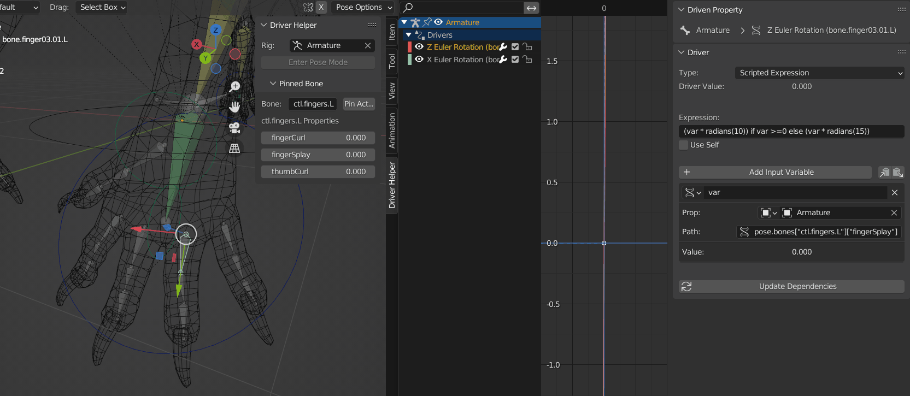
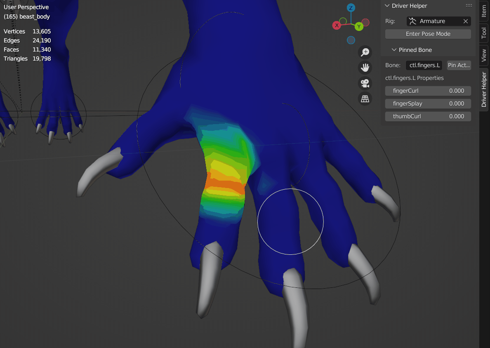

# DriverHelper.py

This tool creates a panel in the 3D workspace that helps speed up your rigging and animating workflow by allowing you to pin a bone's custom properties and access them at any time.

## Features

- Pin a bone to the panel to view and change its custom properties.
- Create and edit drivers with ease - now, you don't have to deselect a bone with a driver on it in order to change a custom property's value. This makes it easier to test and modify drivers that reference custom properties on other bones.
- Pinned custom properties can be displayed and edited outside of pose mode, such as when adjusting weight painting or editing a mesh.
- Animate and key custom properties right from the panel
- Select your armature and switch to pose mode at any time with one click

|  |
|:--:|
| <b>Check how drivers change with custom properties, while editing the driver</b>|

|  |
|:--:|
| <b>Pin a bone with one click.</b>|

|  |
|:--:|
| <b>Change pose custom properties while weight painting, and quickly switch back to pose mode from any other mode</b>|
